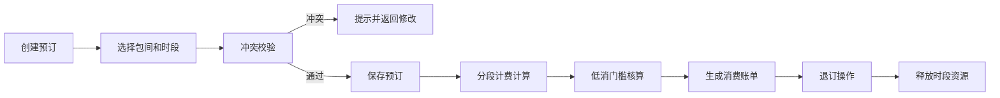

## 1. 产品概述

茶室包间预订管理后台是一款面向茶室经营者的内部管理系统，用于高效管理包间资源、预订排期、时段计费与消费核算。系统通过智能化的冲突检测和分段计费算法，解决传统手工记账效率低、易出错的痛点，提升茶室运营管理水平。

- 核心价值：实现包间预订全流程数字化管理，避免重复预订纠纷，精确核算时段费用
- 目标用户：茶室前台、店长、财务人员
- 市场定位：中小茶室及高端会所的标准化管理工具

## 2. 核心功能

### 2.1 用户角色
| 角色 | 登录方式 | 核心权限 |
|------|----------|----------|
| 管理员 | 账号密码登录 | 全部功能：包间管理、费率配置、预订操作、消费核算、数据查看 |

### 2.2 功能模块
1. **包间排期**：包间资源建档、日历视图排期、预订新增/查看/退订
2. **冲突校验**：时段重叠检测、预订冲突提示、退订时段释放
3. **时段计费**：费率表维护（高峰/平峰/低谷）、跨档时长拆分、分段金额计算
4. **消费核算**：低消门槛校验、消费账单生成、费用明细展示

### 2.3 页面详情
| 页面名称 | 模块名称 | 功能描述 |
|----------|----------|----------|
| 包间排期页 | 包间列表 | 展示所有包间卡片，支持新增/编辑/删除包间 |
| 包间排期页 | 日历排期 | 周视图展示各包间预订状态，点击时段可创建预订 |
| 包间排期页 | 预订表单 | 录入客户信息、选择时段、提交预订并自动校验冲突 |
| 时段费率页 | 费率配置 | 维护高峰/平峰/低谷各时段费率，支持增删改 |
| 时段费率页 | 费率预览 | 可视化展示一天内费率分布时段 |
| 消费核算页 | 账单列表 | 展示所有预订订单及消费状态 |
| 消费核算页 | 账单详情 | 展示分段计费明细、低消核算、应付金额 |

## 3. 核心流程

### 3.1 预订创建流程
管理员在日历视图选择包间和时段，填写客户信息后提交预订。系统自动进行时段冲突检测，若与已有预订重叠则提示错误；若校验通过则创建预订记录并锁定时段。

### 3.2 退订流程
管理员在预订详情中执行退订操作，系统将该时段释放，恢复为可预订状态，同时生成退订记录。

### 3.3 计费核算流程
系统根据预订起始时间和结束时间，自动跨越费率切换点进行分段计算。将每一段时长乘以对应时段费率，累加得出基础费用。再与包间最低消费比较，取较高值作为最终应付金额。

## 4. 用户界面设计

### 4.1 设计风格
- **设计理念**：东方雅致 · 简约现代，融合茶室禅意与管理后台的实用性
- **主色调**：深檀棕 `#5D4037`、米杏色 `#F5F0E6`、墨玉黑 `#2C2C2C`
- **点缀色**：鎏金色 `#C9A96E`、竹叶绿 `#7CB342`
- **按钮风格**：圆角4px，沉稳深棕底色配金色文字，悬停微亮
- **字体**：标题用「思源宋体」体现东方韵味，正文用「Noto Sans SC」保证可读性
- **布局风格**：左侧导航 + 右侧内容区，卡片式布局，留白通透
- **图标**：Lucide 线性图标，统一 18px 尺寸

### 4.2 页面设计总览
| 页面名称 | 模块名称 | UI元素 |
|----------|----------|--------|
| 包间排期 | 包间卡片 | 深木色边框、米杏底、包间名大字、容纳人数标、状态色标 |
| 包间排期 | 日历网格 | 时间轴纵向、包间横向、预订块鎏金填充、悬停浮层详情 |
| 时段费率 | 费率卡片 | 三列并排（高峰/平峰/低谷），不同色阶区分，时段列表清晰 |
| 消费核算 | 账单列表 | 斑马纹表格、金额右对齐、状态标签（待结算/已结算/已退订） |
| 消费核算 | 账单详情 | 分段计费时间轴、低消对比条、合计金额大字突出 |

### 4.3 响应式
桌面端优先设计，最小支持 1280px 宽度。导航侧栏固定宽度 240px，内容区自适应。表格支持横向滚动。

### 4.4 动效设计
- 页面切换：淡入 + 轻微上移，时长 300ms
- 预订块：悬停放大 1.02 倍，阴影加深
- 模态框：背景模糊渐显，内容缩放进入
- 校验错误：输入框红色边框抖动提示
