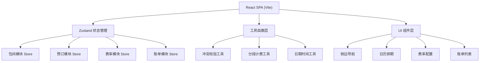
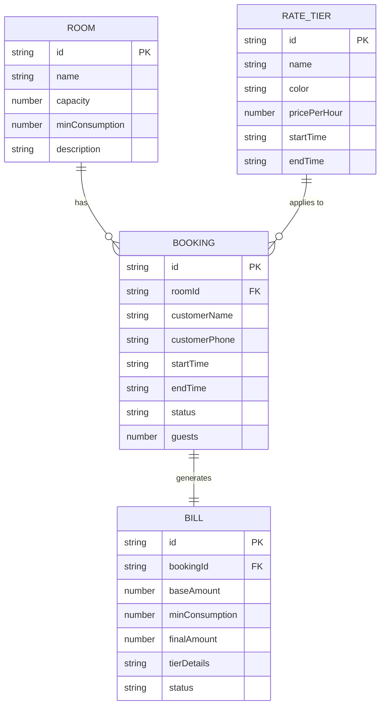

## 1. 架构设计

系统采用纯前端单页应用架构，使用 Zustand 进行全局状态管理，所有数据以 Mock 形式存储在前端状态中，便于演示和独立运行。



## 2. 技术说明

- **前端框架**：React 18 + TypeScript
- **构建工具**：Vite 5
- **样式方案**：Tailwind CSS 3
- **状态管理**：Zustand
- **路由**：React Router DOM 6
- **图标库**：Lucide React
- **后端**：无（纯前端 Mock 数据）
- **数据库**：无（内存状态存储）

## 3. 路由定义

| 路由路径 | 页面名称 | 功能说明 |
|----------|----------|----------|
| `/schedule` | 包间排期 | 日历视图展示包间预订状态，支持创建、查看、退订预订 |
| `/rate` | 时段费率 | 配置高峰/平峰/低谷费率及时段划分 |
| `/billing` | 消费核算 | 展示所有预订账单及消费明细、低消核算 |

## 4. 数据模型

### 4.1 实体关系图



### 4.2 类型定义

```typescript
// 包间
interface Room {
  id: string;
  name: string;
  capacity: number;
  minConsumption: number;
  description: string;
}

// 预订记录
interface Booking {
  id: string;
  roomId: string;
  customerName: string;
  customerPhone: string;
  startTime: string; // ISO datetime
  endTime: string;   // ISO datetime
  status: 'confirmed' | 'cancelled' | 'completed';
  guests: number;
  createdAt: string;
}

// 费率档位
interface RateTier {
  id: string;
  name: 'peak' | 'normal' | 'valley';
  label: string;
  color: string;
  pricePerHour: number;
  startTime: string; // HH:mm
  endTime: string;   // HH:mm
}

// 分段计费明细
interface TierSegment {
  tierName: string;
  tierLabel: string;
  color: string;
  startTime: string;
  endTime: string;
  durationHours: number;
  amount: number;
}

// 账单
interface Bill {
  id: string;
  bookingId: string;
  roomId: string;
  baseAmount: number;
  minConsumption: number;
  finalAmount: number;
  tierDetails: TierSegment[];
  status: 'pending' | 'settled' | 'refunded';
  createdAt: string;
}
```

## 5. 核心算法

### 5.1 时段冲突检测

检测两个时间段是否重叠：
```
isOverlap = (startA < endB) && (endA > startB)
```

遍历同一包间所有有效预订，逐一比较时间段，若存在重叠则返回冲突信息。

### 5.2 跨档分段计费

1. 将预订时间区间与所有费率档时间区间求交集
2. 计算每个交集的时长（小时）
3. 各时段金额 = 时长 × 对应费率
4. 基础费用 = 各时段金额之和
5. 最终费用 = max(基础费用, 包间最低消费)

### 5.3 费率档时间处理

费率档按"当日内"定义（如 18:00-22:00），预订可跨天。计算时将预订时间按日期拆分为多个"当日片段"，分别与费率档匹配。

## 6. 目录结构

```
src/
├── components/          # 通用组件
│   ├── Layout/         # 布局组件（侧边栏、内容区）
│   ├── Calendar/       # 日历排期组件
│   ├── BookingModal/   # 预订表单弹窗
│   ├── BillDetail/     # 账单详情组件
│   └── RateCard/       # 费率卡片组件
├── pages/              # 页面
│   ├── SchedulePage.tsx
│   ├── RatePage.tsx
│   └── BillingPage.tsx
├── store/              # Zustand 状态
│   ├── useRoomStore.ts
│   ├── useBookingStore.ts
│   ├── useRateStore.ts
│   └── useBillStore.ts
├── utils/              # 工具函数
│   ├── conflict.ts     # 冲突检测
│   ├── billing.ts      # 计费计算
│   └── datetime.ts     # 日期时间处理
├── types/              # TypeScript 类型
│   └── index.ts
├── data/               # Mock 数据
│   └── mockData.ts
├── App.tsx
├── main.tsx
└── index.css
```

## 7. 组件设计原则

- 组件粒度适中，单文件不超过 300 行
- 业务逻辑与 UI 分离，复杂逻辑抽离到 utils
- 状态管理集中在 zustand store，组件尽量保持纯净
- 使用 TypeScript 严格类型，杜绝 any
- 遵循一致的命名规范：PascalCase 组件，camelCase 函数变量
